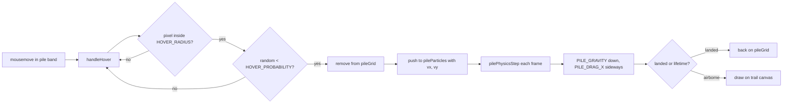

# Pixel pile — tuning guide

How the footer sand pile and hover “explosion” work, and which numbers to change.

**Audience:** humans editing feel, and AI agents asked to adjust the effect.

**Production source of truth:** [`js/pixel-interactions.js`](../js/pixel-interactions.js) (loaded by `index.html`).

**React reference (keep in sync if you use it):** [`brand_ref/components/pixel-interactions/PixelPileFooter.tsx`](../brand_ref/components/pixel-interactions/PixelPileFooter.tsx)

> **Editing `PixelPileFooter.tsx` does not change the live site.** The portfolio page only includes `./js/pixel-interactions.js`. After saving, hard-refresh the browser (Cmd+Shift+R).

---

## For AI agents

When the user asks to change pile hover feel (more explosive, calmer, magnetic, gravity-heavy, etc.):

1. **Edit named constants** at the top of the pile block in `js/pixel-interactions.js` (~lines 268–282).
2. **Swipe scoop logic** lives in `ejectVelocityFromSwipe`, `updatePilePointer`, and `pilePhysicsStep` (`pileSandSettleStep`) — change constants before rewriting formulas.
3. **Do not change** `GRAVITY` / `DRAG_X` at the file top unless the request is about **click/drag cursor trail** — those apply to the trail only.
4. **Use `PILE_GRAVITY` and `PILE_DRAG_X`** for airborne pile grains after hover ejection.
5. **Mirror changes** in `PixelPileFooter.tsx` if the brand_ref package should stay aligned.
6. **Do not remove** `prefers-reduced-motion` guard in `handleHover` (no hover erosion when reduced motion is on).
7. After large grid-size changes, mention that users may need to clear `localStorage` key `pixelPileGrid` to avoid a mismatched saved pile.

Current behavior model (as implemented):

- **Swipe impulse (smoothed):** EMA on pointer delta — timing / slow-in-out, not raw snap.
- **Any cell in disc** can eject (no surface-only cap).
- **Deterministic budget:** Up to `HOVER_EJECT_BUDGET` (+ swipe bonus) grains per `mousemove`, weighted by `t` and depth (not per-cell dice).
- **Linear disc falloff:** `t` from cursor to edge (not `t²`).
- **Launch cap + arc bias:** Speed limited; cross-axis damped (`ARC_CROSS_DAMP`) but not as harsh as the ultra-soft pass.
- **Half bat + light air kick:** Contact pop and mid-flight nudge at ~50% of the old aggressive preset.
- **Sand settle + spread:** Gravity settle, sideways spread (angle-of-repose lite), settle again.
- **Looser landing:** Grains snap to nearest empty cell within ±`LAND_SEARCH_COLS` columns.
- **Looser launch:** Higher `ARC_CROSS_DAMP`, horizontal swipe lift (`LAUNCH_LIFT_ON_SWIPE`).

### Disney principles mapped

| Principle | How it shows up |
|-----------|-----------------|
| **Solid drawing** | Depth bias + sand settle keep a continuous mound |
| **Timing** | `SWIPE_SMOOTHING`, `HOVER_PROBABILITY`, depth bias |
| **Slow in / slow out** | Smoothed swipe, `MAX_LAUNCH_SPEED` cap |
| **Arcs** | Cross-axis damping in `clampLaunchVelocity` |
| **Follow-through** | Grains land back on grid via sand sim after a scoop |
| **Exaggeration** | Toned down vs earlier builds — playful but not violent |

---

## What happens when you hover



1. Cursor moves over the pile band (full viewport height, anchored to the bottom).
2. Each **settled** pixel in a circle around the cursor may be **ejected** into `pileParticles`.
3. Flying grains use **pile-specific physics**, then **land** back on the grid or **expire**.

Click/drag pixels use a **separate** full-screen trail (`GRAVITY` / `DRAG_X`) and can hand off into the pile when they cross the band.

---

## Where to edit

| What | File | Location |
|------|------|----------|
| Hover disc, chance, swipe/bat, pile physics | `js/pixel-interactions.js` | Constants ~268–282 |
| Pointer / swipe tracking | `js/pixel-interactions.js` | `updatePilePointer`, `onPilePointerMove` |
| Launch velocity | `js/pixel-interactions.js` | `ejectVelocityFromSwipe` |
| While grains fall + settle | `js/pixel-interactions.js` | `pilePhysicsStep` |
| Click trail physics | `js/pixel-interactions.js` | Top of file ~15–16 |
| Footer layout (end of document flow) | `css/main.css` | `.pixel-pile-footer` |
| Pixel size (grid resolution) | `js/pixel-interactions.js` | `DOT_SIZE` ~17 |

---

## Named constants (pile block)

Values below reflect **`js/pixel-interactions.js` as of this doc** — verify in file before tuning.

| Constant | Typical role | Turn up → | Turn down → |
|----------|----------------|-----------|-------------|
| `HOVER_RADIUS` | Radius of hover “detonation” disc (px) | Bigger blast area | Smaller, precise scoop |
| `HOVER_PROBABILITY` | Base per-frame eject chance; + boost when cursor moves fast | Faster hole | Slower erosion |
| `HOVER_JITTER` | Random velocity on eject (both axes) | Messier burst | Tighter burst |
| `HOVER_SWIPE_SCALE` | How much smoothed cursor delta adds to launch | Stronger scoop along swipe | Gentler nudge |
| `HOVER_BAT_IMPULSE` | Radial push from pixel → cursor | Stronger contact pop | Weaker kick |
| `HOVER_SPEED_CHANCE_K` / `_MAX` | Extra eject chance when swiping fast | Wilder on fast moves | Same speed idle vs swipe |
| `AIR_KICK_RADIUS` / `AIR_KICK_SWIPE` | Mid-flight grains near cursor follow swipe | More “alive” spray | Subtle |
| `DEPTH_EJECT_BIAS` | Per-row depth multiplier (0–1); `^depth` on chance | Deeper dig | Surface-only feel |
| `ARC_CROSS_DAMP` | Cross-axis launch damp when swipe is mostly one axis | Flatter arcs | More vertical spray |
| `PILE_GRAVITY` | Downward acceleration per frame (pile grains only) | Heavier, faster fall | Floatier hang time |
| `PILE_DRAG_X` | Horizontal speed retained per frame (0–1) | More sideways skid | Motion dies sideways quickly |
| `MAX_PILE_PARTICLES` | Max flying grains at once | More dots (CPU cost) | Effect caps sooner |
| `PEAK_RATIO` | Starting hill height (% of grid rows) | Taller default mound | Flatter start |
| `DOT_SIZE` | Pixel square size (px) | Chunkier, fewer cells | Finer grid |

### `HOVER_RADIUS` (px)

Circle around the cursor. Every **settled** pile pixel whose center is inside this distance can be ejected.

- **Example:** `72` ≈ 144px wide scoop.
- Does **not** control how far grains fly — only **which** pixels can launch.

### `HOVER_PROBABILITY` (0–1)

On **each animation frame** (~60/s), each eligible pixel rolls once: eject if `random() < HOVER_PROBABILITY`.

- `0.15` ≈ 15% chance per pixel per frame.
- **Uniform** across the disc (edge = center).
- Hovering 1 second on a dense patch can eject many pixels; combine with `MAX_PILE_PARTICLES` cap.

### `PILE_GRAVITY`

Added to `vy` every frame in `pilePhysicsStep`. **Only** `pileParticles` (hover + handover from trail), not click trail.

- Trail uses `GRAVITY` (0.18) — usually leave that alone when tuning hover.

### `PILE_DRAG_X`

Multiplies `vx` each frame (`vx *= PILE_DRAG_X`). Lower = sideways speed bleeds off faster.

- `1.0` = no horizontal damping.
- `0.9` = loose tumble; `0.97` (trail) = tighter.

### `MAX_PILE_PARTICLES`

Safety cap. When full, new ejections are skipped until grains land or expire.

### `PEAK_RATIO`

Only affects **initial** pile shape in `initPile` and fresh loads — not hover directly.

### `DOT_SIZE`

Shared with cursor trail. Changing it resizes the grid; saved `pixelPileGrid` in localStorage invalidates on dimension change.

---

## Launch formula (`ejectVelocityFromSwipe`)

```js
vx = jitter + pileSwipeVx * HOVER_SWIPE_SCALE + nx * HOVER_BAT_IMPULSE
vy = jitter + pileSwipeVy * HOVER_SWIPE_SCALE + ny * HOVER_BAT_IMPULSE
// then clampLaunchVelocity (MAX_LAUNCH_SPEED + ARC_CROSS_DAMP)
```

| Piece | Meaning |
|-------|---------|
| `jitter` | `(random - 0.5) * HOVER_JITTER` on each axis |
| `pileSwipeVx/Vy` | Smoothed cursor delta (EMA via `SWIPE_SMOOTHING`) |
| `nx, ny` | Unit vector from cursor to pixel (contact bat outward) |

**Lifetime** on eject: `55 + random * 75` frames (inline in `handleHover`).

**Cat-play feel:** move the mouse **across** the pile quickly; direction of movement should match the spray. Slow hover = gentler erosion.

---

## Click trail only (do not confuse with hover)

| Constant | Value (default) | Affects |
|----------|-----------------|--------|
| `GRAVITY` | 0.18 | Click/drag trail particles |
| `DRAG_X` | 0.97 | Click/drag trail particles |
| `PARTICLES_PER_EVENT` | 5 | Spawns per click/move while pressed |
| `MIN_LIFETIME` / `MAX_LIFETIME` | 300 / 600 | Trail grain lifetime |

---

## Presets (starting points)

Use as recipes; always verify in the browser.

### Gentle scoop

- `HOVER_RADIUS` 40–48  
- `HOVER_PROBABILITY` 0.06–0.08  
- Softer launch: `vx` `(4 + random * 3)`, `vy` `-(1 + random * 4)`  
- `PILE_GRAVITY` 0.28, `PILE_DRAG_X` 0.93  

### Playful burst

- `HOVER_RADIUS` 56–64  
- `HOVER_PROBABILITY` 0.10–0.12  
- Medium launch (current-ish inline formulas)  
- `PILE_GRAVITY` 0.32, `PILE_DRAG_X` 0.92  

### Explosive / chaotic (current design intent)

- `HOVER_RADIUS` 64–72  
- `HOVER_PROBABILITY` 0.12–0.18  
- Wide launch: `vx` `(6 + random * 6)`, `vy` `-(3 + random * 10)`  
- `PILE_GRAVITY` 0.38–0.45, `PILE_DRAG_X` 0.88–0.92  
- Shorter lifetime if screen gets too busy: `45 + random * 60`  

### “Magnetic” repel (legacy style — not default)

Re-add radial velocity from cursor:

```js
const nx = dist > 0 ? dx / dist : 0;
const ny = dist > 0 ? dy / dist : -1;
vx: nx * 2 + (Math.random() - 0.5) * 2,
vy: ny * 1.5 - 1,
```

Feels like pixels **flee** the cursor; less like an explosion + gravity.

---

## “I want…” quick map

| Goal | Adjust |
|------|--------|
| Bigger paw / blast area | ↑ `HOVER_RADIUS` |
| Harder hits when swiping fast | ↑ `HOVER_SWIPE_SCALE` or `HOVER_SPEED_CHANCE_K` |
| More contact pop without full chaos | ↑ `HOVER_BAT_IMPULSE` (try 0.5–0.6 max) |
| Flying grains chase the cursor | ↑ `AIR_KICK_SWIPE` or `AIR_KICK_RADIUS` |
| Flatter scoop (less vertical pop) | ↓ `ARC_CROSS_DAMP` or swipe more horizontally |
| Pile vanishes faster while hovering | ↑ `HOVER_PROBABILITY` |
| Less CPU / fewer dots | ↓ `HOVER_PROBABILITY` or ↓ `MAX_PILE_PARTICLES` |
| Messier random spray | ↑ `HOVER_JITTER` |
| Faster drop after pop | ↑ `PILE_GRAVITY` |
| More sideways skid while falling | ↑ `PILE_DRAG_X` (closer to 1) |
| Taller default pile | ↑ `PEAK_RATIO` |
| Reset weird pile after tuning | Clear `localStorage` → `pixelPileGrid` |

---

## Accessibility & persistence

- **`prefers-reduced-motion: reduce`:** `handleHover` returns immediately; pile is static, no hover erosion.
- **`localStorage` key `pixelPileGrid`:** Saves settled pile every 5s. Stale saves are dropped when grid width/height changes.

---

## Related docs

- [`brand_ref/components/pixel-interactions/README.md`](../brand_ref/components/pixel-interactions/README.md) — React package overview  
- [`docs/animation-system.md`](animation-system.md) — scroll/section motion (separate from pile physics)  
- [`css/main.css`](../css/main.css) — `.pixel-pile-footer` (relative, end of `<main>`; not viewport-fixed)  

---

## Changelog

Document the values you ship when you change feel, so humans and AI know what “current” means:

| Date | `HOVER_RADIUS` | `HOVER_PROBABILITY` | Notes |
|------|----------------|---------------------|-------|
| 2026-05-19 | 72 | 0.32 | Looser launch/land/settle — less vertical tower on horizontal swipe |
| 2026-05-19 | 72 | 0.32 | Looser dig: depth bias `0.82`, linear `t` falloff |
| 2026-05-19 | 72 | 0.24 | No surface/budget; depth bias `0.42` (too solid) |
| 2026-05-19 | 64 | 0.17 | More eject volume (budget 56) — edit `js/pixel-interactions.js`, not TSX |
| 2026-05-19 | 60 | 0.13 | More eject volume only (budget 42); launch physics unchanged |
| 2026-05-19 | 54 | 0.095 | Balanced playful: half bat (0.4), light air kick, more budget/swipe |
| 2026-05-19 | 48 | 0.07 | Too quiet — simplified scoop (reverted column topple earlier) |
| 2026-05-19 | 56 | 0.12 | Elegant cat-play: surface-only, budget, arcs, always settle |
| 2026-05-19 | — | — | Pile container back to document flow (was `position: fixed` overlay bug) |
| 2026-05-19 | 64 | 0.4 | Swipe + bat eject, air kick (superseded — too aggressive) |
| 2026-05-19 | 25 | 0.55 | 3× vx/vy pop, `MAX_PILE_PARTICLES` 10k |
| — | 72 | 0.15 | Earlier uniform detonation preset |
